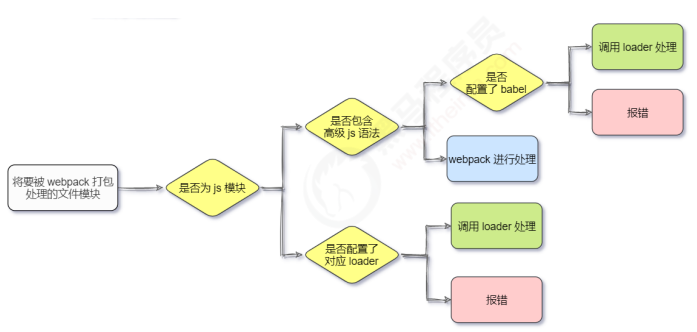

### 前端工程化

1. 前端开发：

+ **模块化**（js 的模块化、css 的模块化、资源的模块化）
+ **组件化**（复用现有的 UI 结构、样式、行为）
+ **规范化**（目录结构的划分、编码规范化、接口规范化、文档规范化、 Git 分支管理）
+ **自动化**（自动化构建、自动部署、自动化测试）

2. 前端工程化

   在**企业级的前端项目开发**中，把前端开发所需的**工具、技术、流程、经验**等进行规范化、 标准化。

   + 好处：前端开发**自成体系**，有一套**标准的开发方案和流程**

3. 前端工程化的解决方案

   早期：

   + grunt
   + gulp

   目前主流：

   + **webpack**（ https://www.webpackjs.com/ ）
   + parcel（ https://zh.parceljs.org/ ）

### webpack的基本使用

1. 什么是webpack

   + webpack 是**前端项目工程化的具体解决方案**
   + 主要功能：提供了友好的**前端模块化开发**支持，以及**代码压缩混淆、处理浏览器端 JavaScript 的兼容性、性能优化**等强大的功能
   + 好处：程序员可把工作重心放到具体功能的实现上，提高了前端**开发效率**和**项目的可维护性**
   + 注意：目前 Vue，React 等前端项目，基本上都是基于 webpack 进行工程化开发的

2. 创建列表隔行变色项目

   ① 新建项目空白目录，并运行 npm init –y 命令，初始化包管理配置文件 package.json 

   ② 新建 src 源代码目录 

   ③ 新建 src -> index.html 首页和 src -> index.js 脚本文件 

   ④ 初始化首页基本的结构

    ⑤ 运行 npm install jquery –S 命令，安装 jQuery

    ⑥ 通过 ES6 模块化的方式导入 jQuery，实现列表隔行变色效果

3. **在项目中安装webpack**

   在终端运行如下的命令，安装 webpack 相关的两个包：

   ```xml
   npm install webpack@5.42.1 webpack-cli@4.7.2 -D
   ```

   **-S是--save的简写   //dependencies开发部署上线均要用**

   **-D是--save-dev的简写   //devdependencies开发要用**

4. **在项目中配置webpack**

   ① 在项目根目录中，创建名为` webpack.config.js` 的 webpack 配置文件，并初始化如下的基本配置：

   ```xml
   module.exports = {
     mode:'development'  //mode用来指定构建模式，可选值有'development'和'production'
   }
   ```

   ② 在 `package.json` 的 `scripts` 节点下，新增 dev 脚本如下：

   ```xml
   "scripts": {
     "dev":"webpack" //script节点下的脚本，可以通过npm run执行，例如npm run dev
   }
   ```

   ③ 在终端中运行 `npm run dev` 命令，启动 webpack 进行项目的打包构建

   **4.1  mode的可选值**

+ development
  + **开发环境**
  + **不会**对打包生成的文件进行**代码压缩**和**性能优化**
  + 打包**速度快**，适合在**开发阶段**使用
+ production
  + **生产环境**
  + **会**对打包生成的文件进行**代码压缩**和**性能优化**
  + 打包**速度很慢**，仅适合在**发布阶段**使用

**4.2 webpack.config.js 文件的作用**

+ webpack.config.js 是 webpack 的配置文件。webpack 在真正开始打包构建之前，会**先读取这个配置文件， 从而基于给定的配置，对项目进行打包**
+ 注意：由于 webpack 是**基于 node.js 开发出来的打包工具**，因此在它的配置文件中，支持使用 node.js 相关 的语法和模块进行 webpack 的个性化配置

**4.3 webpack中的默认约定**

   ① 默认的**打包入口文件为 src -> index.js**

   ② 默认的**输出文件路径为 dist -> main.js**

> 注意：可以在 **webpack.config.js** 中修改打包的默认约定

**4.4 自定义打包的入口与出口**

在 webpack.config.js 配置文件中，通过 `entry` 节点指定**打包的入口**。通过 `output` 节点指定**打包的出口**

```js
const path = require('path')  //导入node.js中专门操作路径的模块

module.exports = {
    // 打包入口的路径
    entry:path.join(__dirname,'./src/index1.js'),
    // output指定生成的文件要放到哪里，path目录，filename文件名
    output: {
        //输出的存放路径
        path:path.join(__dirname,'./dist'),
        filename:'js/bundle.js'
        // 明确告诉webpack把生成的bundle.js文件存放到dist目录下的js子目录中
    }
}
```

### webpack中的插件

1. webpack插件的作用

   通过安装和配置第三方的插件，可以**拓展 webpack 的能力**，从而让 webpack **用起来更方便**。

   + `webpack-dev-server`
     + 类似于 node.js 阶段用到的 nodemon 工具
     + 每当修改了源代码，webpack 会**自动进行项目的打包和构建**
   + `html-webpack-plugin`
     + webpack 中的 HTML 插件（类似于一个模板引擎插件）
     + 可以通过此插件自定制 index.html 页面的内容

2. **webpack-dev-server**

   **webpack-dev-server 可以让 webpack 监听项目源代码的变化，从而进行自动打包构建。**

   2.1 安装webpack-dev-server

   ```js
   npm install webpack-dev-server@3.11.2 -D
   ```

   2.2  配置 webpack-dev-server

   ① 修改 package.json -> scripts 中的 dev 命令如下：

   ```xml
   "scripts": {
       "dev":"webpack serve",  //script下的脚本，可以通过 npm run 执行
   }
   ```

   ② 再次运行 npm run dev 命令，重新进行项目的打包 

   ③ 在浏览器中访问 http://localhost:8080 地址，查看自动打包效果

   >注意：webpack-dev-server 会启动一个**实时打包的 http 服务器**

   2.3 打包生成的文件

   ① 不配置 webpack-dev-server 的情况下，webpack 打包生成的文件，会存放到**实际的物理磁盘上**

   + 严格遵守开发者在 webpack.config.js 中指定配置
   + 根据 **output 节点**指定路径进行存放

   ② 配置了 webpack-dev-server 之后，打包生成的文件**存放到了内存中**

   + 不再根据 output 节点指定的路径，存放到实际的物理磁盘上
   + **提高了**实时打包输出的**性能**，因为内存比物理磁盘速度快很多

   2.4 生成到内存中的文件访问

   ​     webpack-dev-server 生成到内存中的文件，默认**放到了项目的根目录中**，而且是**虚拟的、不可见**的

   + 可以直接用 / 表示**项目根目录，后面跟上要访问的文件名称**，即可访问内存中的文件
   + 例如 /bundle.js 就表示要访问 webpack-dev-server 生成到内存中的 bundle.js 文件

3. **html-webpack-plugin**

   html-webpack-plugin 是 webpack 中的 **HTML 插件**，可以通过此插件**自定制 index.html 页面的内容**

   需求：通过 html-webpack-plugin 插件，将 src 目录下的 index.html 首页，**复制到项目根目录中一份**

   3.1 安装 html-webpack-plugin

   ```xml
   npm install html-webpack-plugin@5.3.2 -D
   ```

   3.2 配置 html-webpack-plugin

   ```js
   // 导入html-webpack-plugin这个插件，得到它的构造函数
   const HtmlPlugin = require('html-webpack-plugin')
   // new 这个构造函数，创建HtmlPlugin实例对象
   const htmlPlugin = new HtmlPlugin({
       // 指定复制哪个文件
       template:'./src/index.html',
       // 指定生成的文件放在哪个路径以及文件名
       filename:'./index.html'
   })
   module.exports = {
       mode:'development',
       plugins:[htmlPlugin],  //通过plugins节点，使htmlPlugin插件生效
   }
   ```

   + 通过 HTML 插件复制到项目根目录中的 index.html 页面，也被放到了内存中

   + HTML 插件在生成的 index.html 页面，自动注入了打包的 bundle.js 文件

4. **devServer 节点**

   在 webpack.config.js 配置文件中，可以通过 devServer 节点对 webpack-dev-server 插件进行更多的配置

   ```js
   devServer: {
           // 第一次打包成功后，自动打开浏览器
           open:true,
           // 指定运行时的主机地址
           host:'127.0.0.1',
           // 实时打包所用的端口号，在http协议中，如果端口号是80，则可以被省略
           port:80
       }
   ```

   > 注意：凡是修改了 webpack.config.js 配置文件，或修改了 package.json 配置文件，**必须重启实时打包的服务器**，否则最新的配置文件无法生效

### webpack中的loader

1.  loader 概述

   在实际开发过程中，webpack 默认只能打包处理以 .js 后缀名结尾的模块。其他**非 .js 后缀名结尾的模块**， webpack 默认处理不了，**需要调用 loader 加载器才可以正常打包**，否则会报错

   loader 加载器的作用：**协助 webpack 打包处理特定的文件模块**

   + css-loader 可以打包处理 .css 相关的文件
   + less-loader 可以打包处理 .less 相关的文件
   + babel-loader 可以打包处理 webpack 无法处理的高级 JS 语法

2. loader 的调用过程

   

3.  打包处理 css 文件

   ① 运行 `npm i style-loader@3.0.0 css-loader@5.2.6 -D` 命令，安装处理 css 文件的 loader 

   ② 在 webpack.config.js 的 `module -> rules` 数组中，添加 loader 规则如下：

   ```js
   module: {
           rules: [
               //数组中定义了不同模块中对应的loader
               {test:/\.css$/,use:['style-loader','css-loader']}
               ]
   }
   ```

   其中，**test** 表示**匹配的文件类型**， **use** 表示对应**要调用的 loader **

   注意： 

   + use 数组中指定的 loader **顺序是固定的** 
   + 多个 loader 的调用顺序是：**从后往前调用**

4.  打包处理 less 文件

   ① 运行 `npm i less-loader@10.0.1 less@4.1.1 -D` 命令 

   ② 在 webpack.config.js 的 module -> rules 数组中，添加 loader 规则如下：

   ```js
   module: {
           rules: [
               {test:/\.less$/,use:['style-loader','css-loader','less-loader']}
               ]
   }
   ```

5. 打包处理样式表中与 **url 路径相关**的文件

   ① 运行 `npm i url-loader@4.1.1 file-loader@6.2.0 -D` 命令 

   ② 在 webpack.config.js 的 module -> rules 数组中，添加 loader 规则如下：

   ```js
   module: {
           rules: [
               // 处理图片文件的loader，如果需要调用的loader只有一个，只传递一个字符串也行，如果有多个loader就用数组
               {test:/\.jpg|png|gif$/,use:'url-loader?limit=1800&outputPath=images'},
               // 在配置url-loader的时候，多个参数之间使用&符号进行分割
               ]
   }
   ```

    其中 **?** 之后的是 **loader 的参数项**： 

   + limit 用来指定**图片的大小**，单位是字节（byte）
   +  只有 ≤ limit 大小的图片，才会被转为 base64 格式的图片

6.  打包处理 js 文件中的高级语法

   webpack 只能打包处理**一部分高级的 JavaScript 语法**。对于那些 webpack 无法处理的高级 js 语法，需要借 助于 **babel-loader** 进行打包处理

   6.1  安装 babel-loader 相关的包

   ```xml
   npm i babel-loader@8.2.2 @babel/core@7.14.6 @babel/plugin-proposal-decorators@7.14.5 -D
   ```

   在 webpack.config.js 的 module -> rules 数组中，添加 loader 规则如下

   ```js
   {test:/\.js$/,use:'babel-loader',exclude:/node_modules/}
   // 在配置babel-loader的时候，程序员只需要把自己的代码进行转换即可
   //一定要排除node_modules目录中的js文件
   // 因为第三方包中的JS兼容性，不需要程序员关心
   ```

   6.2 配置 babel-loader

   在项目根目录下，创建名为 **babel.config.js **的配置文件，定义 **Babel 的配置项**如下：

   ```js
   module.exports = {
       // 声明babel可用的插件
       // 将来webpack在调用babel-loader的时候会先加载plugins插件来使用
       plugins: [
           ['@babel/plugin-proposal-decorators',{ legacy: true}]
       ]
   }
   ```

### 打包发布

1. 为什么要打包发布

   **项目开发完成之后**，需要使用 webpack **对项目进行打包发布**，主要原因有以下两点： 

   + 开发环境下，打包生成的文件**存放于内存中**，无法获取到最终打包生成的文件

   + 开发环境下，打包生成的文件**不会进行代码压缩和性能优化** 

     > **为了让项目能够在生产环境中高性能的运行**，因此需要对项目进行打包发布

2. 配置 webpack 的打包发布

   在 `package.json` 文件的 `scripts` 节点下，新增 build 命令如下：

   ```json
   "scripts": {
       "dev": "webpack serve",
       "build": "webpack --mode production"
     }
   ```

   + **--mode** 是一个参数项，用来指定 webpack 的**运行模式**

   + production 代表生产环境，会对打包生成的文件 进行**代码压缩**和**性能优化**

     > 注意：通过 --mode 指定的参数项，会覆盖 webpack.config.js 中的 mode 选项

3.  把 JavaScript 文件统一生成到 js 目录中

   在 **webpack.config.js** 配置文件的 **output** 节点中，进行如下的配置：

   ```js
   output: {
           path:path.join(__dirname,'./dist'),
           filename:'js/bundle.js',
           // 明确告诉webpack把生成的bundle.js文件存放到dist目录下的js子目录中
   }
   ```

4. 把图片文件统一生成到 image 目录中

   修改 **webpack.config.js** 中的 `url-loader` 配置项，新增 `outputPath` 选项即可指定图片文件的输出路径

   ```js
    {test:/\.jpg|png|gif$/,use:'url-loader?limit=1800&outputPath=images'}
   ```

5. 自动清理 dist 目录下的旧文件

   为了在每次打包发布时**自动清理掉 dist 目录中的旧文件**，可以安装并配置 `clean-webpack-plugin` 插件：

   ```xml
   npm install clean-webpack-plugin@3.0.0 -D
   ```

   ```js
   // 左侧的花括号是解构赋值
   const { CleanWebpackPlugin } = require('clean-webpack-plugin')
   plugins:[htmlPlugin,new CleanWebpackPlugin()]
   ```

### SourceMap

1. 什么是 Source Map

   **Source Map 就是一个信息文件，里面储存着位置信息**

   也就是说，Source Map 文件中存储着压缩混淆后的代码，所对应的**转换前的位置**

   有了它，出错的时候，除错工具将**直接显示原始代码，而不是转换后的代码**，能够极大的方便后期的调试

2. webpack **开发环境**下的 Source Map

   在**开发环境**下，webpack**默认启用**了 Source Map 功能

   当程序运行出错时，可以直接在控制台提示错误行的位置，并定位到具体的源代码

   2.1 默认 Source Map 的问题

   开发环境下默认生成的 Source Map，记录的是**生成后的代码的位置**，会导致**运行时报错的行数**与**源代码的行数**不一致的问题

   2.2 解决默认 Source Map 的问题

   开发环境下，推荐在 `webpack.config.js` 中添加如下的配置，即可**保证运行时报错的行数与源代码的行数保持一致**

   ```js
   module.exports = {
       mode:'development',
       // 在开发调试阶段，建议把devtool的值改成'eval-source-map'
       devtool: 'eval-source-map',
   }
   ```

3.  webpack **生产环境**下的 Source Map

   在**生产环境**下，如果**省略了 devtool 选项**，则最终生成的文件中**不包含 Source Map**

   这能够**防止原始代码通过 Source Map 的形式暴露**给别有所图之人

   3.1 只定位行数不暴露源码

   ```js
   devtool: 'nosources-source-map'
   ```

   3.2 定位行数且暴露源码

   ```js
   devtool: 'source-map'
   ```

   **不安全，直接暴露源码**

   > 采用此选项后，应该将服务器配置为，**不允许普通用户访问 source map 文件**

4. Source Map 的最佳实践

   ① **开发环境**下： 

   +  建议把 devtool 的值设置为 `eval-source-map `
   +  好处：可以精准定位到具体的错误行

   ② **生产环境**下： 

   +  建议**关闭 Source Map** 或将 devtool 的值设置为 `nosources-source-map` 
   +  好处：防止源码泄露，提高网站的安全性

## 实际开发中不需要自己配置 webpack

+ 实际开发中会使命令行工具（俗称 CLI）**一键生成**带有 webpack 的项目 
+ 开箱即用，所有 webpack 配置项都是现成的
+ 只需要知道 webpack 中的基本概念即可