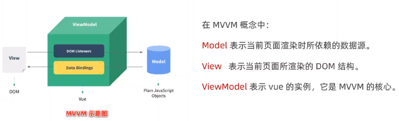

### 什么是vue

####    vue：用于构建用户界面的前端框架

1. 构建用户界面：
   + 用vue往html页面中填充数据
2. 框架：
   + 现成的解决方案，程序员只能遵守框架的规范，去编写自己的业务功能
   + 学习vue就是学习vue框架中规定的用法
   + vue的指令、组件（是对UI结构的复用）、路由、Vuex、vue组件库

### vue的两个特性

1. 数据驱动视图

   + 数据的变化会驱动视图自动更新
   + 好处：程序员只管把数据维护好，那么页面结构会被vue自动渲染出来
   + 注意：数据驱动视图是单向的数据绑定

2. 双向数据绑定

   > 在网页中，form表单负责**采集数据，**Ajax负责**提交数据**  

   + js数据的变化，会被自动渲染到页面上
   + 页面上表单采集的数据发生变化的时候，会被vue自动获取到，并更新到js数据中

### MVVM 

​    **MVVM**是vue实现**数据驱动视图**和**双向数据绑定**的核心原理

​     

> 数据驱动视图和双向数据绑定的底层原理是MVVM（Model数据源、View视图、ViewModel就是vue的实例）

### vue的版本

+ 1.x版本几乎被淘汰
+ **2.x版本的vue是目前企业级项目开发中的主流版本**，在未来（1~2年内）会被逐渐淘汰
+ **3.x版本的vue是未来企业级项目开发的趋势**

### vue指令

#### 1.内容渲染指令

1. **v-text**
   + 会覆盖元素内部原有的内容
   + 不能识别解析标签字符串
2. **插值表达式{{ }}**（英文：Mustache）
   + 专门用来解决v-text覆盖默认文本内容的问题，只是内容的占位符，不会覆盖原有的内容
   + 实际开发中常用
   + 不能识别解析标签字符串
3. **v-html**
   + 会覆盖元素内部原有的内容
   + 主要作用：可以把标签字符串渲染成真正的HTML内容

#### 2.属性绑定指令

> 注意：插值表达式只能在元素的内容节点中使用，不能在元素的**属性节点**中使用

+ 在vue中，可以使用**`v-bind:`**指令，为元素的属性动态绑定属性值

+ 简写是英文的**`:`**
+ 在使用v-bind属性绑定期间，如果绑定内容需要进行动态拼接，则字符串的外面应该包裹单引号

```js
 <div :title="'box'+index"></div>
```

> 在vue提供的模板渲染语法中，除了支持**绑定简单的数据值**之外， 还支持**Javascript表达式的运算**

#### 3.事件绑定 

1. `v-on:`：给元素绑定事件，简写是`@`，如@click，@input，@keyup

2. 语法格式为：

   ```xml
   <button v-on:click="add">+1</button>
   <button @click="sub">+1</button>
   
   methods: {
     add() {
       //如果在方法中要修改data的值，可以通过this访问到
       this.count++
     },
     sub() {
       this.count--;
     }
   }
   ```

3. `$event`的应用场景：如果默认的事件对象e被覆盖了，则可以手动传递一个$event.如

   ```xml
   <button @click="add(3,$event)">+3</button>
   
   methods: {
      add(n,e) {
         this.count+=n;
         e.target.style.backgroundColor='red';
   }
   }
   ```

4. 事件修饰符

   > 在事件处理函数中调用event.preventDefault()(阻止默认事件)或event.stopPropagation()(阻止冒泡事件)是非常常见的需求，因此vue提供了`事件修饰符`的概念，可以更方便的**对事件的触发进行控制**

   + `.prevent`

     ```xml
     <a @click.prevent="xxx">链接</a>
     ```

   + `.stop`

     ```xml
     <button @click.stop="xxx">按钮</button>
     ```

5. 按键修饰符

   > 监听**键盘事件**时，经常需要判断详细的按键，此时可以为键盘相关的事件添加`按键修饰符`

   ```xml
    <input type="text" @keyup.esc="clearInput" @keyup.enter="commitAjax">
     
     methods: {
       clearInput(e) {
          console.log('触发了clearInput方法');
          e.target.value = ''
         },
        commitAjax() {
           console.log('触发了commitAjax方法');
         }
    }
   ```

#### 4.双向绑定指令

+ `v-model`:双向数据绑定指令，辅助开发者在不操作DOM的前提下，快速绑定表单数据

  ```xml
  <input type="text" v-model="username">
      data: {
          username:'Lanky'
      }
  ```

  作用范围：(*主要就是表单元素*)

  1. input输入框，如`type="radio"`、`type="checkbox"`、`type="xxx"`等
  2. textarea
  3. select

+ v-model指令的修饰符

  | 修饰符  | 作用                           | 示例                         |
  | ------- | ------------------------------ | ---------------------------- |
  | .number | 自动将用户的输入值转为数值类型 | <input v-model.number="age"> |
  | .trim   | 自动过滤用户输入的首尾空白字符 | <input v-model.trim="msg">   |
  | .lazy   | 在表单元素失去焦点时更新数据   | <input v-model.lazy="msg">   |

#### 5.条件渲染指令

1. `v-show`的原理：动态为元素添加或移除`display:none`样式，来实现元素的显示和隐藏

   + 如果是要频繁地切换元素的显示状态，用v-show性能会更好

2. `v-if`的原理：动态地创建或移除元素，来实现元素的显示和隐藏

   + 如果刚进入页面的时候，某些元素默认不需要被展示，而且后期这个元素很可能也不需要被展示出来，此时用v-if性能更好

   > 实际开发中，绝大多数情况下，不用考虑性能问题，直接使用v-if就好   

   v-if 指令在使用的时候，有两种方式：

   1. 直接给定一个布尔值 true 或 false

      ```xml
      <p v-if="true">被 v-if 控制的元素</p>
      ```

   2. 给 v-if 提供一个判断条件，根据判断的结果是 true 或 false，来控制元素的显示和隐藏

      ```xml
      <p v-if="type === 'A'">良好</p>
      ```

3. `v-else-if、v-else`：充当v-if的else-if、else块，可以连续使用，必须搭配v-if使用，否则不被识别

   ```xml
   <div v-if="type==='A'">优秀</div>
   <div v-else-if="type==='B'">良好</div>
   <div v-else-if="type==='C'">一般</div>
   <div v-else>差劲</div>
   
   data: {
      type:'A'
   }
   ```

#### 6.列表渲染指令

`v-for`：辅助开发者**基于一个数组来循环渲染一个列表结构**，v-for指令需要使用`item in list`形式的特殊语法，其中**list是待循环的数组，item是被循环的每一项**。v-for还支持一个**可选的**第二个参数，即**当前项的索引**，语法格式为`(item,index) in list`(item,index是形参，可以重命名)

```xml
<tbody>
  <tr v-for="(item,index) in list" :key="item.id">
     <td>{{ index }}</td>
     <td>{{ item.id }}</td>
     <td>{{ item.name }}</td>
     <td>{{ item.subject }}</td>
     <td>{{ item.offer }}</td>
  </tr>
</tbody>
 data: {
   list: [ {
      id:1001,
      name:'Lanky',
      subject:'web前端',
      offer:'待业'
    }, {
      id:1002,
      name:'ilanky',
      subject:'后端开发',
      offer:'网易实习生'
    }, {
      id:1003,
      name:'张三',
      subject:'法律漏洞',
      offer:'监狱常驻人员'
    }]
 }
```

+ 官方建议：只要用到了v-for指令，那么一定要绑定一个key属性，key的值是不能重复的，否则会终端报错`Duplicate keys detected`
+ key值的注意事项
  + key值只能是**字符串**或**数字**类型
  + 必须具有**唯一性**
  + 建议把**数据项id属性值**作为key值
  + 使用index值作为key值**没有任何意义**
  + 建议使用v-for指令时**一定要指定key的值**（既提升性能，又防止列表状态紊乱）
