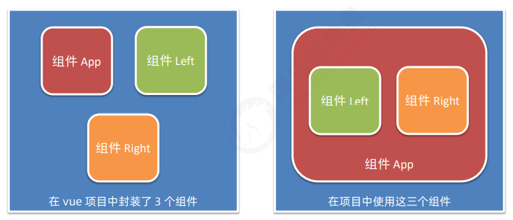
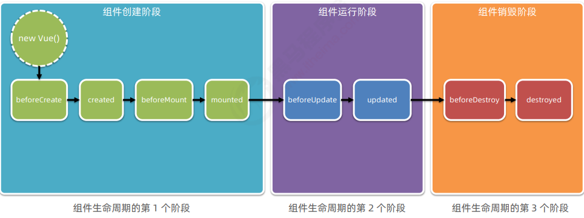

### vue组件

#### 1. 组件化开发

根据**封装**的思想，**把页面上可复用的UI结构封装为组件**，从而方便项目的开发和维护

#### 2. vue中的组件开发

+ vue是一个**支持组件化开发**的前端框架
+ 组件的后缀名是`.vue`

#### 3.vue组件的三个组成部分

+ **template**：组件的**模板结构**
+ **script**：组件的**JavaScript行为**
+ **style**：组件的**样式**

> 其中，每个组件中必须包含**template**模板结构，而script行为和style样式是可选的组成部分

1. `template`

   每个组件对应的**模板结构**，需要定义到`<template>`节点中

   ```vue
   <template> </template>
   ```

   > 注意：
   >
   > 1. template是vue提供的**容器标签**，只起到**包裹性质的作用**，并不会被渲染为真正的DOM元素
   > 2. template中只能包含**唯一的根节点**

2. `script`

   可以在`<script>`节点中**封装组件的JavaScript业务逻辑**

   ```vue
   <script>
   export default { 
      data(){
          return {username:'Lanky'}
      },
       methods: {
           ...
       }
   }
       //组件相关的data数据、methods方法等，都需要定义到export default所导出的对象中
   </script>
   ```

   > vue组件中的**data**必须是一个**函数**，不能直接指向一个数据对象，会导致**多个组件实例共用同一份数据**的问题

3. `style`

   可以在`<style>`节点中**编写样式美化当前组件的UI结构**

   ```vue
   <style>
       h1 {
           font-weight:700
       }
   </style>
   ```

   > 让style中支持**less语法**：
   >
   > 在<style>标签上添加lang="less"属性，即可使用less语法编写组件的样式
   >
   > `<style lang="less> </style>"`

#### 4. 组件之间的父子关系



组件在被**封装**好之后，**彼此之间是互相独立的**。

在**使用**组件的时候，根据**彼此的嵌套关系**，形成了*父子关系、兄弟关系*

1. 使用组件的三个步骤

   + 步骤1：使用`import`语法**导入需要的组件**

     ```js
     import Left from '@/components/Left.vue'
     // @/表示src目录下，需要配置
     ```

   + 步骤2：使用**components**节点**注册组件**

     ```js
     export default {
         components: {
             Left
             //如果在模板结构中使用的是同名标签，可以简写为该组件名
             //要对它重命名，可以用 left:Left的形式
         }
     }
     ```

   + 步骤3：以**标签形式**使用刚才注册的组件

     ```html
     <div class="box">
         <Left></Left>
     </div>
     ```

2. 通过 components 注册的是**私有子组件**

   >例如：
   >
   >在组件 A 的 components 节点下，注册了组件 F
   >
   >则组件 F 只能用在组件 A 中；不能被用在组件 C 中

3.  注册**全局组件**

   在 vue 项目的 **main.js** 入口文件中，通过 `Vue.component()` 方法，可以注册全局组件

   ```js
   //导入需要全局注册的组件
   import Count from '@/components/Count.vue'
   //参数1：字符串格式，表示组件的‘注册名称’
   //参数2：需要被全局注册的组件
   Vue.component('MyCount',Count)
   ```

#### 5. 组件的props

组件的**自定义属性**。在封装通用组件时，合理地使用props可以**极大地提高组件的复用性**

```js
export default {
    props:['自定义属性A','自定义属性B','其他自定义属性...']
}
```

1. props是**只读**的，**不能直接修改**props的值，否则会报错

   要想修改 props 的值，可以把 **props 的值转存到 data** 中，因为 data 中的数据都是可读可写的

   ```js
   props:[init],
   data() {
       return {
           count:this.init 
           //把init的值转存到count
       }
   }
   ```

2. props 的 **default** 默认值

   在声明自定义属性时，可以通过对象形式的props里的default属性来**定义属性的默认值**

   ```js
   export default {
       props:{
           init:{
               default:0
           }
       }
   }
   ```

3.  props 的 **type** 值类型

   在声明自定义属性时，可以通过 type 来**定义属性的值类型**

   ```js
   export default {
       props:{
           init:{
               type:Number
               //如果传递过来的值不符合此类型，会在终端报错
           }
       }
   }
   ```

4. props 的 **required** 必填项

   可以通过 required 选项，**将属性设置为必填项，强制用户必须传递属性的值**

   ```js
   export default {
       props:{
           init:{
               required:true
               //必填项校验
           }
       }
   }
   ```

#### 6.组件之间的样式冲突问题

默认情况下，**写在`.vue`组件中的样式会全局生效**，因此容易造成多个组件之间的样式冲突问题

> 导致组件之间样式冲突的根本原因是：
>
> 1. 单页面应用程序中，所有组件的 DOM 结构，都是基于**唯一的 index.html 页面**进行呈现的
> 2. **每个组件中的样式**，都会**影响整个 index.html 页面**中的 DOM 元素

1. 解决方案：`style`节点的`scoped`属性

   + 原理：为每个组件**分配唯一的自定义属性**，在编写组件样式时，通过**属性选择器来控制样式的作用域**

     ```vue
     <template>
       <div class="container" data-v-001>
           <h3 data-v-001>属性选择器来控制样式的作用域</h3>
         </div>
     </template>
     <style lang="less">
         /* 通过[]属性选择器来防止组件之间的“样式冲突问题”，因为每个组件分配的自定义属性是“唯一的” */
         .container[data-v-001] {
             border:1px solid red;
         }
     </style>
     ```

   + 为了提高开发效率和开发体验，vue为`style`节点提供了`scoped`属性，从而防止组件之间的样式冲突问题（为每一个当前组件的标签自动分配唯一的自定义属性）

     ```vue
     <template>
       <div class="container">
           <h3>属性选择器来控制样式的作用域</h3>
         </div>
     </template>
     <style lang="less" scoped>
         /* style 节点中的scoped属性用来自动为每个组件分配唯一的“自定义属性”
         并自动为当前组件的DOM标签和style样式应用这个自定义属性，防止组件的样式冲突问题 */
         .container {
             border:1px solid red;
         }
     </style>
     ```

2. **/deep/**样式穿透

   如果给当前组件的 style 节点添加了 scoped 属性，则当前组件的样式对其**子组件**是**不生效**的。如果想让某些样式对子组件生效，可以使用 **/deep/ 深度选择器**

   ```vue
   <style lang="less" scoped>
       .title {
           color:blue; /* 不加/deep/时，生成的选择器格式为.title[data-v-xxx] */
       }
       /deep/ .title {
           color:bule; /* 加上/deep/时，生成的选择器格式为[data-v-xxx] .title */
       }
   </style>
   ```

   > 当使用第三方组件库的时候（如vant、layui），如果有修改第三方组件默认样式的需求，需要用到/deep/

#### 7. 组件的实例对象

html是无法自动解析.vue组件的，需要通过`vue-template-compiler`将vue组件编译成js文件渲染到页面上

一个组件在定义的时候只是一个模板结构（可以简单理解定义了一个构造函数），当以标签的形式去使用这个模板结构的时候才是在创建它的实例

### 生命周期

+ **生命周期**（Life Cycle）是指一个组件从**创建 -> 运行 -> 销毁**的整个阶段，强调的是一个**时间段**

+ **生命周期函数**：是由 vue 框架提供的**内置函数**，会伴随着组件的生命周期，**自动按次序执行**

+ 组件生命周期函数的分类

  

+ 生命周期图示（***每学完一个阶段回来看看，加深理解***）


#### 1. 组件创建阶段

> 组件生命周期的第1个阶段

beforeCreate：基本没什么用（props、methods、data等未被创建）

**created：生命周期函数非常常用，经常在里面调用methods中的方法，请求服务器的数据，并且把请求到的数据，转存到data中，供template模板渲染的时候使用**

beforeMount：基本没什么用（HTML结构编译好放在内存中，DOM元素还在内存，未被渲染到页面）

**mounted：如果要操作当前组件的DOM，最早只能在mounted执行**

+ 此阶段每个函数执行1次

#### 2. 组件运行阶段

> 组件生命周期的第2个阶段

beforeUpdate：数据是新的，DOM结构是旧的

**updated：数据是新的，DOM结构也是新的。如果在数据变化后要操作最新的DOM结构，要把代码写在updated中**

+ 此阶段会执行最少0次，最多n次

#### 3. 组件销毁阶段

> 组件生命周期的第3个阶段（极少用）

beforeDestroy：将要销毁，尚未销毁

destroyed：DOM结构、数据等完全移除

+ 此阶段在销毁时执行1次

### 组件之间的数据共享

#### 1.组件之间的关系

​    最常见的有：

+ 父子关系
+ 兄弟关系

#### 2. 父子组件之间的数据共享

+ **父 -> 子**： 父组件向子组件共享数据

  父组件向子组件共享数据需要使用**自定义属性**

  ```vue
  //父组件
  <Son :msg="message" :user="userinfo"></Son>
  
  data() {
     return {
        message:'hello vue.js',
        userinfo: { name:'zs' , age:20}
          }
  }
  ```

  ```vue
  //子组件
  <template>
     <div>
         <p>父组件传过来的msg值为 ：{{ msg }}</p>
         <p>父组件传过来的user值为 ：{{ user }}</p>
      </div>
  </template>
  
  props:['msg','user']
  ```

+ **子-> 父**： 子组件向父组件共享数据

  子组件向父组件共享数据需要使用**自定义事件**

  ```vue
  //子组件
  <template>
    <button @click="send">向父组件共享数据</button>
  </template>
  <script>
  export default {
      data() {
          return {
              str:'data from son'
          }
      },
      methods: {
          send() {
              //自定义事件发送数据，第一个参数为自定义事件名，第二个参数为传送的数据
              this.$emit('sonData',this.str)
          }
      }
  }
  </script>
  ```

  ```vue
  //父组件
  <template>
  //自定义事件被触发时调用getSonData方法
     <Son @sonData="getSonData"></Son>
     <p>{{ dataFromSon }} </p>
  </template>
  <script>
      import Son from './components/Son.vue'
  export default {
      components:{Son},
      data() { return { dataFromSon}},
      methods: {
          // val是从子组件传过来的值
          getSonData(val) { this.dataFromSon = val}
      }
  }
  </script>
  ```

#### 3. 兄弟组件之间的数据共享

+ 在 vue2.x 中，兄弟组件之间数据共享的方案是 **`EventBus`**

  ```js
  // EventBus.js
  import Vue from 'vue'
  export default new Vue()
  ```

  ```vue
  //兄弟组件A,发送数据方使用$emit
  <script>
   import bus from './eventBus.js'
   export default {
       data() { return { bro:'hey bro~'}},
       methods: {
           sendToBro() {
               bus.$emit('share',this.bro)
           }
       }
   }
  </script>
  ```

  ```vue
  //兄弟组件B,接收数据方使用$on
  <script>
  import bus from './EventBus.js'
  export default {
      data() { return {brother:''}},
      created() {
          //自定义事件同名
          bus.$on('share',val => {
              this.brother = val
          })
      }
  }
  </script>
  ```

  

