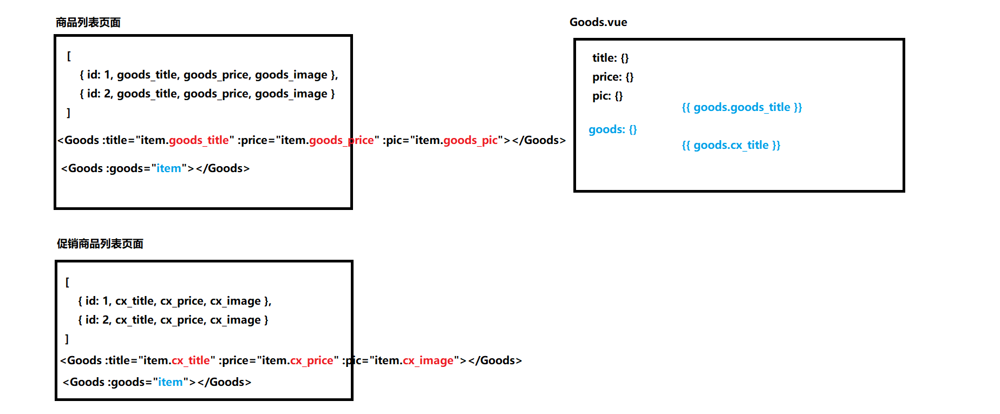
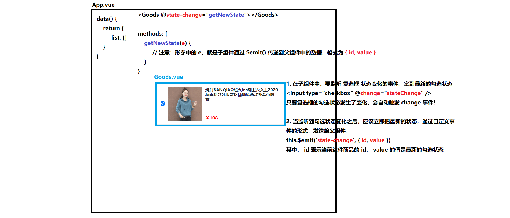

### ref引用

#### 1.什么是ref引用

`jQuery`简化了程序员*操作DOM的过程*，而在`vue`中，由于数据驱动视图，程序员**不需要操作DOM**，只需要把数据维护好即可，所以在**vue**中，**不建议安装使用jQuery**

ref引用就是辅助开发者在**不依赖jQuery**的情况下，获取**DOM元素或组件**的引用

> 每个vue组件的实例上，都包含一个**$refs对象**，里面储存着对应的DOM元素或组件的引用，默认情况下**组件的$refs指向一个空对象**

#### 2. 使用ref引用DOM元素

```vue
<h3 ref="myh3">获取h3这个DOM元素</h3>
const dom = this.$refs.myh3
```

> 注意：ref的命名不能重名，同名的话最后一个该名字的DOM元素会覆盖前面的DOM元素

#### 3.使用ref引用组件实例

```vue
<MyCount ref="countRef"></MyCount> 
//子组件
this.$refs.countRef.resetCount()
//this.$refs.countRef可以获取到子组件的实例，可以直接调用子组件里面的方法、数据等
```

#### 4. this.$nextTick(cb)方法

组件的$nextTick(callback)方法，会把callback回调函数**推迟到下一个DOM更新周期之后执行**

>通俗的理解是：等组件的 DOM 更新完成之后，再执行 cb 回调函数。从而能保证 cb 回调函数可以操作到最新的 DOM 元素

```vue
//案例：点击按钮显示文本框后自动获得焦点
<template>
 <div>
     <button @click="showIpt" v-if="flag">显示文本框</button>
     <input type="text" ref="iptRef" v-else>
    </div>
</template>
<script>
export default {
    data() { return {flag :true}},
    methods: {
        showIpt() {
            this.flag = false;
            //此时如果直接执行this.$refs.iptRef.focus()，因为js是单线程，此时只更新了数据还没有将数据重新渲染到DOM结构中（即beforeUpdate），DOM结构中没有input元素，undefined，无法调用focus()
            //所以要等组件的DOM更新完成后再执行回调函数，才可以操作到最新的DOM
            this.$nextTick(() => {
                this.$refs.iptRef.focus()
            })
        }
    }
}
</script>
```

### 数组中的方法（review）

+ some(function(item,index))
+ every(function(item,index))
+ reduce(function(total,item,index),initialValue)

### 购物车案例

> 注意：
>
> + 在较低版本的vue中，v-for不绑定**:key**会报错
> + vue版本建议和**vue-template-compiler**版本一致，不然会出现很多错误
>
> + 一个数据的结果要依赖其他数据的变化动态地计算，用计算属性
> + 数字处理方法：小数位num.toFixed(2) //两位小数

##### 关于自定义组件的属性传递问题

App.vue组件中嵌套Goods.vue组件列表**更建议**使用自定义属性**将列表中的每一项数据分开传递**给Goods组件，为了**提高组件的复用性**。

有些列表里对象的**属性名是不同**的，如果直接把一整个列表传递过去，可能会造成**找不到对应属性**而页面渲染失败



##### 修改商品状态的思路

> 绑定复选框勾选状态时，虽然使用v-model双向数据绑定指令看似方便，但是因为从父组件传递数据是通过自定义属性传值的，所以绑定的是一个自定义属性，自定义属性是只读的，所以使用v-model会报错



#### 学习项目阶段要学会的能力：

1.自学能力 

2.调bug能力 

3.分析解决问题的能力