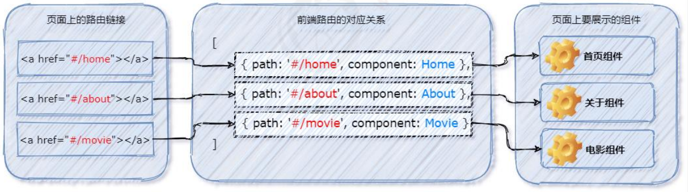
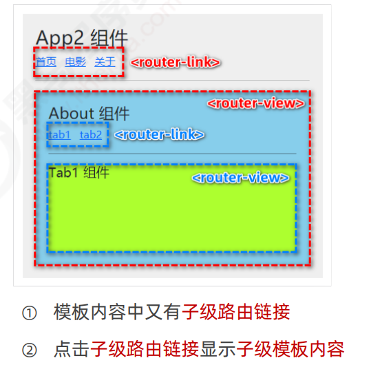
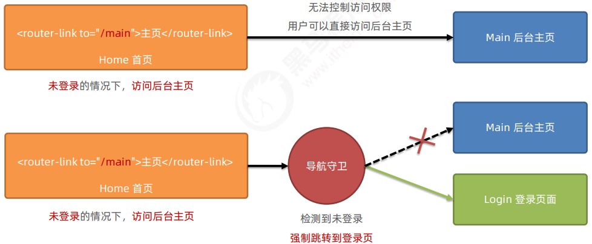
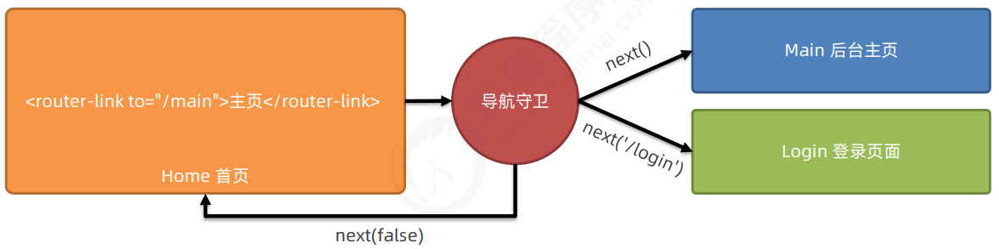

### 路由（router）

路由：就是**对应关系**

在SPA项目中，**不同组件之间的切换**要**依赖前端路由**来完成

> 通俗易懂的概念：**Hash地址**与**组件**之间的**对应关系**

#### 前端路由的工作方式

1. 用户点击页面上的路由链接，导致URL地址中的Hash值发生了变化
2. 前端路由监听到了Hash地址的变化
3. 前端路由把当前Hash地址对应的组件渲染到浏览器中



#### 实现简单的前端路由（原理）

```vue
<template>
 <div>
     <!-- 为a链接添加对应的hash值 -->
     <a href="#/home">首页</a>
     <a href="#/movie">电影</a>
     <a href="#/about">关于</a>
     <!-- 通过is属性指定要展示的组件名称 -->
     <component :is="comName"></component>
    </div>
</template>
<script>
export default {
    data(){ return {comName: 'Home'} },
    created() {
        // 在created声明周期函数中，监听浏览器地址中hash地址的变化，动态切换要展示的组件的名称
        window.onhashchange = () => {
            switch(location.hash) {
                case '#/home':
                    this.comName = 'Home'
                    break
                case '#/movie':
                    this.comName = 'Movie'
                    break
                case '#/about':
                    this.comName = 'About'
                    break
            }
        }
    }
}
</script>
```

### vue-router的基本使用

`vue-router`是vue.js官方给出的**路由解决方案**，只能结合vue项目进行使用，能够轻松地管理SPA项目中组件的切换

#### 1.vue-router的安装和配置

1. 安装vue-router包：`npm i vue-router@3.5.2 -S`

2. **创建路由模块**

   ```js
   // 1.导入vue和vue-router的包
   import Vue from 'vue'
   import VueRouter from 'vue-router'
   // 2.使用Vue.use()函数把VueRouter安装为vue的插件
   Vue.use(VueRouter)
   // 3.创建路由的实例对象
   const router = new VueRouter()
   // 4.向外共享路由的实例对象
   export default router
   ```

3. 导入并挂载路由模块：在 `src/main.js` 入口文件中，导入并挂载路由模块

   ```js
   import router from '@/router'
   // 在进行模块化导入的时候，如果给定的是文件夹，则默认导入这个文件夹里名为index.js的文件
   new Vue( {
       //在vue项目里想要使用路由，必须把路由的实例对象通过以下方式进行挂载
      router:router
   })
   ```

4. **声明路由链接和占位符**

   在**组件**中使用vue-router提供的`<router-link>`和`<router-view>`声明**路由链接**和**占位符**

   ```vue
   <template>
    <div>
        <router-link to="/home">首页</router-link>
        <router-link to="/movie">电影</router-link>
        <hr>
        <router-view></router-view>
       </div>
   </template>
   ```

> 当安装和配置了vue-router后，就可以使用**`<router-link>`**来**代替普通的a链接**
>
> **`<router-view>`**的作用：占位符

#### 2.vue-router的匹配规则

在**路由模块**中，通过**`routes`数组**声明路由的匹配规则

```js
// 导入需要使用路由切换展示的组件
import Home from '@/components/Home.vue'
import Movie from '@/components/Movie.vue'
const router = new VueRouter( {
    routes: [
        // 在routes数组中，声明路由的匹配规则
        // 作用：定义hash地址与组件之间的对应关系
        // path表示要匹配的hash地址，component表示要展示的路由组件
        { path:'/home', component:Home },
        { path:'/movie', component:Movie}
    ]
})
```

### vue-router的常见用法

#### 1.路由重定向

用户在访问**地址 A** 的时候，**强制用户跳转**到**地址 C** ，从而展示特定的组件页面

通过路由规则的`redirect`属性，指定一个新的**路由地址**，设置路由的重定向

```js
const router = new VueRouter({
    routes: [
        // 当用户访问 / 的时候，通过redirect属性跳转到/home对应的路由规则
        { path:'/' , redirect: '/home'}
    ]
})
```

#### 2.嵌套路由

通过路由实现**组件的嵌套展示**，叫做嵌套路由



1. 声明**子路由链接**和**子路由占位符**

   ```vue
   <!-- About.vue -->
   <template>
    <div>
        <router-link to="/about/tab1">tab1</router-link>
        <router-link to="/about/tab2">tab2</router-link>
        <hr>
        <router-view></router-view>
       </div>
   </template>
   ```

2. 通过`children`属性声明**子路由规则**

   ```js
   const router = new VueRouter({
       routes:[ {
           { // about页面的路由规则
           path:'/about',
           component:About,
           children: [  // 通过children属性嵌套声明子级路由规则
           { path:'tab1', component:Tab1}, // 访问/about/tab1时展示Tab1组件
           { path:'tab2', component:Tab2}   // 访问/about/tab2时展示Tab2组件       
           ]
       }
       }]
   })
   ```

3. 嵌套路由的**重定向**

   + 在需要嵌套路由的路由规则中加`redirect`属性，对应一个默认的**hash地址**

     ```js
      path:'/about',
      redirect:'/about/tab1'
     ```

   + 添加**默认子路由**

     ```js
     { path: '' , component:Tab1 }
     // 用这种方法需要将组件的路由链接改为 /about
     ```

     > 如果children数组中，某个路由规则的path值为空字符串，则这条路由规则叫做默认子路由

#### 3.动态路由匹配

动态路由指的是：把**hash地址中可变的部分**定义为**参数项**，从而**提高路由规则的复用性**

在vue-router中使用**英文的冒号  `:` ** 来定义路由规则的参数项

```js
{ path:'/movie/:id', component: Movie }
```

+ **$route**：路由的**参数对象**
+ **$router**：路由的**导航对象**

1. **$route.params** 参数对象

   在**动态路由**渲染出来的组件中，可以用`this.$route.params`对象**访问到动态匹配的参数值**

   ```vue
   <template>
     <h3>
         {{ this.$route.params.id }}
       </h3>
   </template>
   ```

2. 使用**props**接收路由参数

   为了**简化路由参数的获取**，可以为**路由规则**开启**props传参**，从而方便地拿到动态参数的值，在路由规则中加**props**属性

   ```vue
   // 组件部分
   <p>{{ id }}</p>
   props:['id']
   // 路由模块
   { path:'/movie/:id', component:Movie, props:true }
   ```

   > 1. 在定义路由规则时，声明props:true现象
   > 2. 组件中使用props接收路由规则中匹配到的参数项
   > 3. 直接使用props中接收到的路由参数

   **拓展：**

   > + 在hash地址中， `/` 后面的参数项叫做**路径参数**
   >
   >   在路由参数对象($route)中，需要使用`this.$route.params`来访问路径参数
   >
   > + 在hash地址中， `?` 后面的参数项，叫做**查询参数**
   >
   >   在路由参数对象中，需要使用`this.$route.query`来访问查询参数
   >
   > + 在参数对象中，`path`只是**路径部分**，`fullPath`是**完整的地址**，如：
   >
   >   fullPath: /movie/2?name=zs&age=20
   >
   >   path:/movie/2

#### 4.声明式导航&编程式导航

+ **声明式导航**：在浏览器中，**点击**链接实现导航的方式，如`<a>`链接，`<router-link>`链接
+ **编程式导航**：在浏览器中，**调用API**实现导航的方式，如`location.href`

##### vue-router中的编程式导航API

1. this.$router.**push**('hash地址')
   + **跳转**到指定的hash地址，并**增加**一条历史记录
2. this.$router.**replace**('hash地址')
   + **跳转**到指定的hash地址，并**替换掉当前的历史记录**
3. this.$router.**go**(n)
   + 实现导航历史的**前进、后退**，如go(-1)表示后退一层
   + 如果后退的层数**超过上限**，则**原地不动**
4. 在实际开发中，一般只会前进或后退一层页面，所以vue-router为this.$router.go(n)方法提供了两个便捷方法
   + this.$router.**forward()**:在历史记录中**前进**到上一个页面
   + this.$router.**back()**：在历史记录中**后退**到下一个页面
5. 在**行内**使用**编程式导航**跳转时，**this必须要省略**，否则会报错

#### 5.导航守卫

**导航守卫**可以**控制路由的访问权限**



1. 全局前置守卫

   每次发生路由的**导航跳转**时，都会**触发全局前置守卫**，程序员可以针对每个路由进行**访问权限的控制**

   ```js
   const router = new VueRouter({...})
   router.beforeEach(fn)
   // 调用路由实例对象的beforeEach方法，即可声明“全局前置守卫”
   // 每次发生路由导航跳转的时候，都会自动触发fn这个回调函数
   ```

2. 守卫方法的3个形参

   ```js
   router.beforeEach((to,from,next)=>{ ... })
   ```

   + **to**：是**将要访问**的路由信息对象
   + **from**：是**将要离开**的路由信息对象
   + **next**：是一个函数，调用next()表示**放行**，允许本次路由导航

3. next函数的3中调用方式

   

   + 当用户**拥有**后台主页的访问权限，**直接放行**`next()`
   + 当用户**没有**后台主页的访问权限，**强制其跳转到登录页面**`next('/login')`
   + 当用户**没有**后台主页的访问权限，**不允许跳转到后台主页**`next(false)`

4. 控制后台主页的访问权限

   > 思路：
   >
   > 1. 拿到用户将要访问的hash地址
   >
   > 2. 判断hash地址是否等于 /main
   >
   >    2.1 如果等于 /main，证明需要登录之后才能成功访问
   >
   >    2.2 如果不等于 /main，则不需要登录，直接放行next()
   >
   > 3. 如果访问的地址是 /main，则需要读取localStorage中的token值
   >
   >    3.1 如果有token，则放行
   >
   >    3.2 如果没有token，则强制跳转到 /login 登录页面

   ```js
   const router = new VueRouter({...})
   router.beforEach((to,from,next) => {
       if(to.path === '/main') {
           const token = localStroage.getItem('token')
           if(token) {
               next() //访问的是后台主页且有token值
           }else {
               next('/login')  // 访问的是后台主页但是没有token值
           }
       }else {
           next() // 访问的不是后台主页，直接放行
       }
   })
   ```

### 案例--demo-admin

